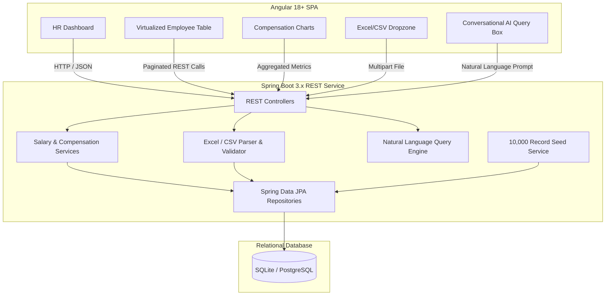

# ACME Global Salary Management Platform

[](https://openjdk.org/)
[](https://spring.io/projects/spring-boot)
[](https://angular.dev/)
[](LICENSE)

> **Incubyte Engineering Assessment — Software Craftsperson (Java / Angular)**  
> An enterprise-grade, web-based salary management and compensation intelligence platform designed for ACME Org's HR leadership to manage and analyze compensation for **10,000+ employees across international offices**.

---

## 1. Executive Summary & Problem Context

ACME Organization currently manages salary and compensation data for **10,000 employees distributed across multiple countries** using disparate, uncoordinated Excel spreadsheets. This manual workflow creates:
- **Operational Vulnerabilities:** Version drift, lack of audit trails, broken formulas, and security risks with sensitive compensation figures.
- **Analytical Friction:** Answering fundamental leadership questions (*"How does ACME pay people across regions, roles, and bands?"*, *"Are there pay disparities?"*, *"What is our projected annual payroll runway?"*) requires hours of manual spreadsheet reconciliation.
- **Scalability Bottlenecks:** Excel suffers significant performance degradation with complex formulas and multi-currency models at 10k+ rows.

### The Solution
A unified, responsive, and secure web application combining:
1. **Core Salary Management:** Fast, searchable, paginated, and sortable directory for 10,000+ employee records.
2. **Compensation Intelligence & Analytics:** Real-time dashboards visualizing salary distribution, departmental breakdown, pay bands, and international currency normalization.
3. **Conversational AI Querying:** An HR-exclusive conversational assistant that answers natural language questions about organizational pay directly from the data.
4. **Excel / CSV Data Ingestion:** Drag-and-drop file ingestion engine with schema validation and discrepancy reporting to simplify transition from existing spreadsheets.
5. **Deterministic 10k Seeding:** Automated data generator producing realistic multi-country corporate payroll data for immediate end-to-end evaluation.

---

## 2. Technology Stack & Architectural Decisions

The technology stack is carefully selected to reflect the **Software Craftsperson (Java / Angular)** role, emphasizing type safety, long-term maintainability, testability, and developer experience.

### Backend
| Technology | Version | Rationale |
| :--- | :--- | :--- |
| **Java** | 21+ LTS / 23 | Modern language features (Records, Pattern Matching, Virtual Threads), robust type safety, and high throughput. |
| **Spring Boot** | 3.x | Industry standard for enterprise micro-services and web applications; rich ecosystem for security, data access, and testing. |
| **Spring Data JPA / Hibernate** | 3.x | Object-relational mapping with optimized query projections, pagination (`Pageable`), and index management. |
| **Relational Database** | SQLite / H2 / PostgreSQL | Dual-mode persistence: embedded SQLite/H2 for zero-config, instant local execution; PostgreSQL for containerized deployments. |
| **Testing** | JUnit 5, Mockito, AssertJ | Fast, deterministic unit tests and slice tests (`@DataJpaTest`, `@WebMvcTest`) guaranteeing high coverage. |
| **Documentation** | SpringDoc OpenAPI (Swagger UI) | Interactive REST API specification and client contract generation. |

### Frontend
| Technology | Version | Rationale |
| :--- | :--- | :--- |
| **Angular** | 18+ | Enterprise-grade component architecture, strict TypeScript typing, Standalone Components, and Signals for fine-grained reactivity. |
| **Component System** | Tailwind CSS / Angular Material | Modern, accessible, and responsive user interface tailored for HR workflows. |
| **Data Visualization** | Chart.js / ng2-charts | High-performance interactive salary distribution histograms, regional heatmaps, and pay band charts. |
| **Virtualization** | CDK Virtual Scroll | Silky smooth 60fps rendering of 10,000+ tabular records without browser DOM exhaustion. |

### Architecture Principles
- **Clean / Layered Architecture:** Clear decoupling of Domain Entities, Use Cases (Services), Data Access (Repositories), and Presentation (REST Controllers).
- **TDD & Software Craftsmanship:** Writing fast, isolated tests first for domain logic (e.g., currency normalization, pay band calculations, CSV parsers).
- **Graceful Error Handling:** Centralized exception translation producing RFC 7807 problem details.

---

## 3. High-Level System Architecture



---

## 4. Planned Project Structure

```text
incubyte-assessment/
├── .github/
│   └── workflows/              # CI pipeline (build, test, lint)
├── backend/                    # Spring Boot 3 Backend
│   ├── src/
│   │   ├── main/
│   │   │   ├── java/com/incubyte/salary/
│   │   │   │   ├── domain/     # Core entities & business logic
│   │   │   │   ├── service/    # Application services & business operations
│   │   │   │   ├── repository/ # Spring Data JPA repositories
│   │   │   │   ├── web/        # REST controllers & DTOs
│   │   │   │   ├── ingestion/  # Excel / CSV parsing & validation
│   │   │   │   ├── ai/         # Conversational compensation query engine
│   │   │   │   └── seeder/     # 10,000 employee realistic data seeder
│   │   │   └── resources/      # Application properties, schemas, seed templates
│   │   └── test/               # Comprehensive unit and integration test suite
│   ├── pom.xml
│   └── Dockerfile
├── frontend/                   # Angular 18+ Frontend
│   ├── src/
│   │   ├── app/
│   │   │   ├── core/           # Guards, interceptors, core models
│   │   │   ├── features/       # Feature modules (dashboard, directory, analytics, chat)
│   │   │   └── shared/         # Reusable components, pipes, directives
│   │   └── assets/
│   ├── package.json
│   ├── angular.json
│   └── Dockerfile
├── docs/                       # Craftsmanship & Architectural Artifacts
│   ├── prd-requirements.md     # One-page PRD & deliberate exclusions
│   ├── architecture-adr.md     # Architectural decision records
│   ├── ai-workflows-prompts.md # Log of AI tool prompts & engineering decisions
│   └── data-model.md           # Database ER diagram & schema definitions
├── docker-compose.yml          # Single-command full-stack containerization
├── .gitignore
└── README.md
```

---

## 5. Development Roadmap & Milestones

1. **Phase 1: Product Definition & Requirements Clarification**
   - Submit formal requirement clarifications to stakeholders.
   - Author the One-Page Product Requirements Document (PRD) detailing scope, features, and deliberate exclusions.
   - Design domain data models (multi-country compensation, employee roles, departments, currencies).

2. **Phase 2: Backend Core & Seeding (TDD)**
   - Initialize Spring Boot project with Clean Architecture layers.
   - Build database schema and write the 10,000 record realistic data seeder.
   - Implement paginated REST APIs with dynamic filtering, sorting, and aggregate analytics calculations.
   - Comprehensive test suite (unit + repository integration tests).

3. **Phase 3: Frontend HR Dashboard (Angular 18)**
   - Scaffold Angular application with standalone components and signals.
   - Build virtualized salary directory table supporting instant filtering across 10k rows.
   - Build compensation analytics visualizations (pay parity, country comparisons, salary bands).
   - Implement drag-and-drop Excel/CSV importer with schema feedback.

4. **Phase 4: Conversational AI Query Interface**
   - Implement natural language query engine to answer analytical questions about how the organization pays people.
   - Pluggable LLM abstraction with local deterministic fallback mode for offline evaluation.

5. **Phase 5: Packaging, Verification & Demonstration**
   - Multi-stage Docker setup and `docker-compose` orchestration.
   - End-to-end testing and performance benchmark verification on 10,000 records.
   - Cloud deployment and video demonstration walkthrough.

---

## 6. Prerequisites & Local Setup

### Prerequisites
- **Java:** JDK 21+ LTS
- **Build Tool:** Apache Maven 3.9+
- **Node.js:** Node 20+ & npm
- **Git**

### Quick Start (Local Development)

#### 1. Clone the repository
```bash
git clone https://github.com/ankithsanga/incubyte-assessment.git
cd incubyte-assessment
```

*(Detailed build and run commands will be populated upon component scaffolding)*

---

## 7. Artifacts & Engineering Notes

This repository follows Incubyte's craftsmanship ethos by documenting the thinking process behind every major decision:
- Requirements Document & Deliberate Scope Exclusions: [`docs/prd-requirements.md`](docs/prd-requirements.md)
- Architectural Decision Records (ADRs): [`docs/architecture-adr.md`](docs/architecture-adr.md)
- AI Tooling & Prompt Logs: [`docs/ai-workflows-prompts.md`](docs/ai-workflows-prompts.md)
