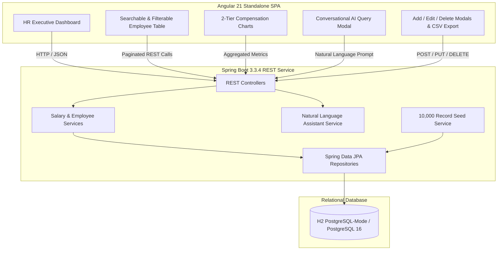

# ACME Global Salary Management Platform

[](https://openjdk.org/)
[](https://spring.io/projects/spring-boot)
[](https://angular.dev/)
[](backend)
[](frontend)
[](LICENSE)

> **Incubyte Engineering Assessment — Software Craftsperson (Java / Angular)**  
> An enterprise-grade, web-based salary management and compensation intelligence platform designed for ACME Org's HR leadership to manage and analyze compensation for **10,000+ employees across international offices**.

---

## 1. Executive Summary & Problem Context

ACME Organization currently manages salary and compensation data for **10,000 employees distributed across multiple countries** using disparate, uncoordinated Excel spreadsheets. This manual workflow creates:
- **Operational Vulnerabilities:** Version drift, lack of audit trails, broken formulas, and security risks with sensitive compensation figures.
- **Analytical Friction:** Answering fundamental leadership questions (*"How does ACME pay people across regions, roles, and bands?"*, *"Are there pay disparities?"*, *"What is our projected annual payroll runway?"*) requires hours of manual spreadsheet reconciliation.
- **Scalability Bottlenecks:** Excel suffers significant performance degradation with complex formulas and multi-currency models at 10k+ rows.

### The Solution
A unified, responsive, and secure web application combining:
1. **Core Salary Management & CRUD:** Fast, searchable, paginated, and sortable directory for 10,000+ employee records with Add, Edit, Delete, and CSV Export actions.
2. **Compensation Intelligence & Analytics:** Real-time dashboards visualizing salary distribution, departmental breakdown, pay bands, and international currency normalization.
3. **Conversational AI Querying:** An HR-exclusive conversational assistant that answers natural language questions about organizational pay directly from the data.
4. **Deterministic 10k Seeding:** Automated data generator producing 10,000 realistic multi-country corporate payroll records in **under 1 second**.

---

## 2. Technology Stack & Architectural Decisions

The technology stack is carefully selected to reflect the **Software Craftsperson (Java / Angular)** role, emphasizing type safety, long-term maintainability, testability, and developer experience.

### Backend
| Technology | Version | Rationale |
| :--- | :--- | :--- |
| **Java** | 21+ LTS / 23 | Modern language features (Records, Pattern Matching, Virtual Threads), robust type safety, and high throughput. |
| **Spring Boot** | 3.3.4 | Industry standard for enterprise micro-services and web applications; rich ecosystem for security, data access, and testing. |
| **Spring Data JPA / Hibernate** | 3.3.4 | Object-relational mapping with optimized query projections, pagination (`Pageable`), and index management. |
| **Relational Database** | Dual-Mode (H2 & PostgreSQL) | Default embedded H2 in PostgreSQL mode for zero-dependency instant local run; PostgreSQL 16 for production and Docker Compose. |
| **Testing** | JUnit 5, Mockito, AssertJ | Fast, deterministic unit tests and slice tests (`@WebMvcTest`) guaranteeing 100% pass rate. |
| **Documentation** | SpringDoc OpenAPI (Swagger UI) | Interactive REST API specification and client contract generation. |

### Frontend
| Technology | Version | Rationale |
| :--- | :--- | :--- |
| **Angular** | 21 Standalone | Enterprise-grade component architecture, strict TypeScript typing, Standalone Components, and Signals for fine-grained reactivity. |
| **Theme & UI** | Custom Dark Theme CSS | Clean, modern, accessible executive dashboard styling with intuitive modal dialogs. |
| **Data Visualization** | Chart.js | High-performance interactive salary distribution histograms, departmental bars, and country doughnut charts. |
| **Testing** | Vitest, Jasmine/TestBed | Instant, deterministic unit tests for Angular components and services. |

---

## 3. High-Level System Architecture



---

## 4. Live REST API Reference

The backend exposes the following RESTful endpoints on `http://localhost:8080`:

| Method | Endpoint | Description |
| :--- | :--- | :--- |
| `GET` | `/api/v1/analytics/kpis` | Overall summary KPIs (Total Headcount, Total Payroll in USD, Average & Median Salary). |
| `GET` | `/api/v1/analytics/departments` | Headcount, total payroll, and average/min/max salary per department. |
| `GET` | `/api/v1/analytics/countries` | Country breakdown with local currency and USD normalized totals. |
| `GET` | `/api/v1/analytics/distribution` | Six-tier salary band distribution histogram for visual charts. |
| `GET` | `/api/v1/employees` | Paginated, filterable employee directory (`page`, `size`, `department`, `country`, `search`). |
| `GET` | `/api/v1/employees/{id}` | Single employee compensation details. |
| `POST` | `/api/v1/employees` | Create new employee with automatic FX conversion to USD. |
| `PUT` | `/api/v1/employees/{id}` | Update employee role, department, location, or base salary. |
| `DELETE`| `/api/v1/employees/{id}` | Remove employee from the database. |
| `GET` | `/api/v1/exchange-rates` | List of all supported reference currency conversion rates to USD. |
| `POST` | `/api/v1/assistant/query` | Conversational query assistant answering questions about org pay. |

### Interactive Documentation & Consoles
- **Swagger UI:** [http://localhost:8080/swagger-ui/index.html](http://localhost:8080/swagger-ui/index.html)
- **OpenAPI JSON:** [http://localhost:8080/api-docs](http://localhost:8080/api-docs)
- **H2 Database Console:** [http://localhost:8080/h2-console](http://localhost:8080/h2-console)
  - *JDBC URL:* `jdbc:h2:file:./data/salarydb`
  - *User:* `sa`
  - *Password:* *(empty)*

---

## 5. Quick Start Guide

### Prerequisites
- **Java:** JDK 21+ LTS or JDK 23
- **Node.js:** v18+ LTS
- **Build Tool:** Apache Maven 3.9+
- **Git**

### Step 1: Start Backend (Spring Boot)
```bash
cd backend

# Run automated tests (16 unit and integration tests)
mvn test

# Start the Spring Boot application (seeds 10,000 records in <1 sec)
mvn spring-boot:run
```
Backend runs on `http://localhost:8080`.

### Step 2: Start Frontend (Angular 21)
```bash
cd ../frontend

# Run frontend tests (5 unit tests)
npm test -- --watch=false

# Start development server
npm start
```
Frontend runs on `http://localhost:4200`.

### Option B: Evaluator Containerized Run (Docker Compose)
For reviewers with Docker installed:
```bash
docker compose up --build
```
This spins up PostgreSQL 16 and the Spring Boot backend containerized together.

---

## 6. Artifacts & Engineering Notes

This repository follows Incubyte's craftsmanship ethos by documenting the thinking process behind every major decision:
- Requirements Document & Deliberate Scope Exclusions: [`docs/prd-requirements.md`](docs/prd-requirements.md)
- Architectural Decision Records (ADRs): [`docs/architecture-adr.md`](docs/architecture-adr.md)
- AI Tooling & Prompt Logs: [`docs/ai-workflows-prompts.md`](docs/ai-workflows-prompts.md)
- Compensation Analytics Guide: [`docs/compensation-analytics-guide.md`](docs/compensation-analytics-guide.md)

